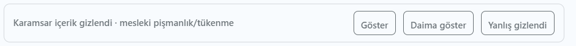
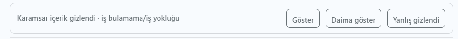
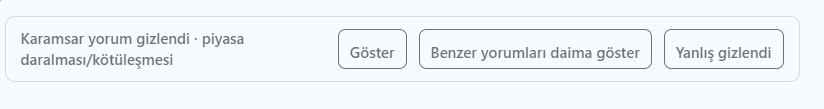

# Reddit Karamsarlık Filtresi

[](https://github.com/umut-yalcn/reddit-new-filter/actions/workflows/ci.yml)
[](LICENSE)

Seçili Türkçe teknoloji/mühendislik subredditlerindeki karamsar kariyer postlarını ve yorumlarını tarayıcıda yerel olarak gizleyen userscript.

Bu bağımsız topluluk projesi Reddit tarafından geliştirilmemiş, onaylanmamış veya desteklenmemiştir. Reddit ve subreddit adları ilgili sahiplerine aittir.

Hedef topluluklar:

- r/CodingTR
- r/TurkDev
- r/EngineeringTR
- r/TrGameDeveloper
- r/UniversityTR
- r/teknoloji
- r/Kariyer
- r/acikkaynak
- r/AndroidTurkiye
- r/LinuxTurkey
- r/ERPTurkiye
- r/AppDevTR

## Davranış

Filtre post başlığı ve gövdesini ayrı ayrı cümle/cümceciklere böler. “Yazılım bitti”, “CENG'in geleceği yok”, “tıp oku”, “AI işimizi elimizden aldı” gibi sinyalleri Türkçe çekim ve yazım varyasyonlarıyla puanlar. Karar ilgisiz cümlelerin toplamından değil en güçlü cümlecikten çıkar.

Eşiği geçen post DOM'dan silinmez. Gizlenir ve yerine neden ile birlikte bir **Göster** düğmesi bırakılır. Geçici olarak açılan post ve yorumlar **Tekrar gizle** ile aynı sayfada yeniden kapatılabilir; bu geçiş kişisel kural oluşturmaz. Motor hata verirse fail-open davranır; içerik görünür kalır.

Yorumlar aynı motorla ayrı ayrı değerlendirilir. Bir yorum gizlendiğinde yalnız o yorumun kendi metni ve işlem satırı kapanır; alt yanıtları görünür kalır. Yorum filtresi userscript menüsünden post filtresinden bağımsız kapatılabilir.

Oturumdaki Reddit hesabının kendi post ve yorumları puanlanmadan görünür bırakılır ve karar günlüğüne eklenmez. Hesap adı modern Reddit ve old Reddit başlığından otomatik algılanır. Reddit arayüzü bunu sağlamazsa kullanıcı adı userscript menüsünden bir kez girilebilir; bu yedek değer yalnız userscript deposunda tutulur.

Kişisel kurallar açıksa gizlenen posttaki **Daima göster** ve gizlenen yorumdaki **Benzer yorumları daima göster** düğmeleri düzenlenebilir bir ifade kaydeder. Kalibrasyon modundaki görünür içeriklerde karşılık gelen **Daima gizle** düğmeleri bulunur. Post kuralları yalnız postlara, yorum kuralları yalnız yorumlara uygulanır; birden fazla kural eşleşirse en uzun ifade, eşit uzunlukta ise en son tercih kazanır.

Varsayılan eşik 4'tür. Soru başlıklarının özel koruması kapalıdır; “Yazılım bitti mi?” normal bir karamsar başlık gibi değerlendirilir. İsteğe bağlı soru koruması açılırsa yalnız başlık puanı yarıya iner, gövde puanı değişmez.

## Gizleme bildirimi ve geri alma seçenekleri

Filtrelenen postlarda gizleme nedeni ve üç seçenek gösterilir:

- **Göster:** İçeriği yalnızca o an için açar.
- **Daima göster:** Benzer içeriği tekrar gizlememek üzere yerel bir kişisel kural oluşturur.
- **Yanlış gizlendi:** Kararı yanlış pozitif olarak işaretler ve içeriği geri getirir.

Postlar; örneğin “mesleki pişmanlık/tükenmişlik” veya “iş bulamama/iş yokluğu” gibi gerekçelerle gizlenebilir.





Yorumlarda benzer bir arayüz bulunur. **Benzer yorumları daima göster** seçeneği, aynı türdeki yorumlar için yerel bir kişisel gösterme kuralı oluşturur.



## Kurulum

Güncel kararlı sürüm `0.5.1`'dir.

1. Tampermonkey kurun. Violentmonkey ile temel userscript API'lerinin uyumlu olması
   beklenir ancak kararlı sürümün elle doğrulanan birincil hedefi Tampermonkey'dir.
2. [Kararlı userscript dosyasını açın](https://raw.githubusercontent.com/umut-yalcn/reddit-new-filter/stable/dist/reddit-doom-filter.user.js).
3. Userscript yöneticisinde kaynak ve izinleri inceleyip kurulumu onaylayın.
4. Reddit'i yenileyin.

Kararlı paket yalnız kontrollü `stable` dalındaki aynı dosyadan güncelleme denetimi yapar. Normal `main` geliştirme push'ları kurulu betiğe dağıtılmaz. Güncelleme kaynak kodu kullanıcı betiği yöneticisinde incelenebilir; geliştirme paketi otomatik güncelleme adresi taşımaz. Kaynak kod [GitHub reposunda](https://github.com/umut-yalcn/reddit-new-filter), hata ve öneriler [Issues](https://github.com/umut-yalcn/reddit-new-filter/issues) bölümünde tutulur.

`0.4.1-expanded-dev` kullananlar kişisel kurallarını önce menüden dışa aktarabilir. Kararlı betik kurulduktan sonra kurallar içe aktarılır ve **Reddit Karamsarlık Filtresi Yorum DEV** kapatılır. Karar günlüğü analiz için indirilebilir ancak kararlı betiğe içe aktarılmaz.

`0.5.0` ve daha eski sürümlerde kararlı otomatik güncelleme adresi yoktur. Bu
sürümlerden gelen kullanıcılar `0.5.1` dosyasını yukarıdaki kararlı bağlantıdan bir
kez elle kurmalıdır. Bundan sonraki sürüm denetimleri kontrollü `stable` kanalı
üzerinden yapılır.

İzole geliştirme paketi üretmek isteyenler `npm run build:comments-dev` komutuyla
`dist/reddit-doom-filter.comments-dev.user.js` dosyasını oluşturup bunu userscript
yöneticisinde yerel dosya olarak açabilir. Bu geliştirme çıktısı otomatik güncelleme
adresi taşımaz ve repoda takip edilmez.

Userscript menüsünden:

- Filtreyi açıp kapatabilirsiniz.
- Soru başlıklarını koruma seçeneğini değiştirebilirsiniz.
- Debug gerekçelerini açabilirsiniz.
- Kalibrasyon düğmelerini açabilirsiniz.
- Yorum filtresini bağımsız açıp kapatabilirsiniz.
- Otomatik hesap algılanamazsa kendi Reddit kullanıcı adınızı yerel olarak ayarlayabilirsiniz.
- Kişisel kuralları açıp kapatabilir, silebilir, indirebilir, içe aktarabilir veya sıfırlayabilirsiniz.
- Yerel karar günlüğünü JSON olarak indirebilir veya tamamen sıfırlayabilirsiniz.
- On iki subreddit filtresini ayrı ayrı açıp kapatabilirsiniz.

## Kalibrasyon ve geri bildirim

Filtre, hedef subredditlerde değerlendirdiği en fazla 500 benzersiz post/yorum kararını yalnız tarayıcıdaki userscript deposunda saklar. Aynı Reddit içeriği tekrar işlendiğinde yeni kayıt oluşturmak yerine mevcut kaydın görülme sayısı güncellenir. Elle etiketlenmiş kayıtlar sınır uygulanırken etiketsiz kayıtlardan önce korunur.

Kişisel göster/gizle kuralları da yalnız userscript deposunda tutulur ve 100 kayıtla sınırlıdır. İndirilen kural JSON dosyaları başka geliştirme sürümüne içe aktarılabilir. Eski kapsam bilgisi olmayan kurallar geriye uyumluluk için yalnız post kuralı kabul edilir.

- Gizlenen post ve yorumlarda **Yanlış gizlendi** düğmesi yanlış pozitif etiketi kaydeder ve içeriği geri getirir.
- Userscript menüsünden kalibrasyon modu açılırsa görünür bırakılan post ve yorumlarda **Gizlenmeliydi** düğmesi belirir.
- **Karar günlüğünü indir** komutu kararları, puanları, tetiklenen cümleyi ve kullanıcı geri bildirimini yerel bir JSON dosyasına aktarır.

Kalibrasyon modu varsayılan olarak kapalıdır. Günlük otomatik olarak dışarı gönderilmez; indirme yalnız menü komutu çalıştırıldığında yapılır.

İndirilen karar günlüğü Reddit içerik metinleri, subreddit bilgisi ve zaman damgaları içerebilir. Bu JSON dosyasını paylaşmadan veya bir Issue'a eklemeden önce içeriğini inceleyin ve kişisel ya da üçüncü taraf verilerini temizleyin. Kişisel kural dışa aktarımları da kullanıcının yazdığı ifadeleri içerir.

Geri bildirim değerlendirilen içerik ve kararın imzasına bağlıdır. Post gövdesi veya filtre kararı değişirse eski etiket yeni karara taşınmaz. Günlük yazımları kısa aralıklarla toplu yapılır ve sayfa kapanırken bekleyen kayıt diske aktarılır.

## Geliştirme

Geliştirme ve test için Node.js `22.22.2`, `24.15.0` veya bunların aynı ana sürümdeki daha yeni yamaları; alternatif olarak Node.js `26+` gerekir. Derlenmiş userscriptin çalışması için Node.js gerekmez.

```bash
npm install
npm test
npm run evaluate
npm run build
npm run check
npm run check:comments-dev
```

- `core/normalize.js`: Türkçe ve sansürlü yazım normalizasyonu.
- `core/clauses.js`: cümle/cümlecik ayrımı.
- `core/scorer.js`: DOM'dan bağımsız puan ve karşıt anlatım motoru.
- `core/content-dom.js`: yeni ve old Reddit post/yorum çıkarımı.
- `core/filter.js`: dinamik post/yorum izleme, güvenli gizleme ve geri alma.
- `core/overrides.js`: post/yorum kapsamlı ve en fazla 100 yerel kişisel kural.
- `core/journal.js`: yerel, sınırlı ve geri bildirimli karar günlüğü.
- `corpus/negative-examples.js`: kullanıcıdan alınmış yüksek güvenli negatif örnekler.
- `userscript/main.js`: ayarlar ve userscript başlangıcı.
- `test/`: pozitif, karşıt, DOM ve dinamik feed regresyonları.

`npm run evaluate`, projedeki yüksek güvenli negatif corpus'u tanısal olarak ölçer. Komuta ek dosya yolları verilirse Markdown veya metin corpus'ları da ayrıca değerlendirilebilir. `npm run check` bütün `*.test.js` dosyalarını otomatik bulur; build, userscript sözdizimi, sürüm eşleşmesi ve deterministik çıktı denetimlerini birlikte çalıştırır.

`npm run check`, kararlı paketin post/yorum kapsamını, eski kural geçişini ve bundle duman testini de doğrular. `npm run check:comments-dev` bunlara ek olarak üretim betiğinden ayrı, otomatik güncelleme adresi taşımayan `dist/reddit-doom-filter.comments-dev.user.js` dosyasını doğrular.

`npm run benchmark:ci`, 1.000 yorum ve azami kişisel kural sayısıyla kaba bir
performans regresyon sınırı uygular. Bu jsdom tabanlı ölçüm gerçek tarayıcı
performansının yerine geçmez; yalnız belirgin yavaşlamaların CI'da fark edilmesini
sağlar.

## Gizlilik ve kapsam

- Reddit API veya harici scraping servisi kullanılmaz.
- Yalnız tarayıcının yüklediği DOM yerel olarak değerlendirilir.
- Userscript yöneticisi yalnız kararlı sürüm güncellemesini denetlemek için GitHub'daki `stable` dağıtım dosyasına erişebilir; çalışma zamanı Reddit içeriğini GitHub'a göndermez.
- Betik açık `DOM` sandbox'ında çalışır ve sayfaya global debug nesnesi bırakmaz.
- Post/yorum metni, tarama geçmişi veya kullanıcı bilgisi dışarı gönderilmez.
- İsteğe bağlı elle girilen Reddit kullanıcı adı yalnız kendi içeriklerini muaf tutmak için userscript deposunda saklanır.
- Kalibrasyon günlüğü yalnız yerel userscript deposunda tutulur ve 500 kayıtla sınırlıdır.
- Kişisel kurallar yalnız yerel userscript deposunda tutulur ve 100 kayıtla sınırlıdır.
- Userscript depolama API'si kullanılamazsa Reddit origin depolamasına geçilmez; veriler yalnız o çalıştırma için bellekte tutulur.
- Çok büyük ilk DOM taramaları 50 içeriklik parçalara bölünür; tek içerikten puanlanan metin uzunluğu ayrıca sınırlandırılır.
- Reddit hesabında gerçek engelleme, silme veya moderasyon yapılmaz.
- İngilizce dil desteği bu sürümün kapsamında değildir.

## Bilinen sınırlar

- Reddit DOM yapısını değiştirdiğinde seçiciler güncellenebilir.
- Türkçe doğal dil kuralları kesin değildir; geri alma çubuğu bu nedenle korunur.
- Puan ağırlıkları daha büyük bir normal kontrol grubuyla yeniden kalibre edilmelidir.
- X/Reddit arayüz ve userscript yöneticisi değişiklikleri kurulum akışını etkileyebilir.
